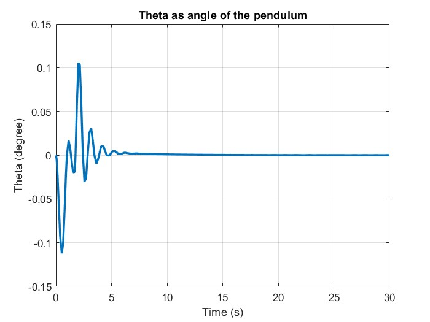

# CartACO
Fuzzy-PID Control of a Fourth-Order Nonlinear System Using Ant Colony Optimization Algorithm
Fourth-Order Nonlinear System: two-degree-of-freedom cart-pole system.
# PID Controller

<figure>

</figure>

<figure>

</figure>

<figure>

</figure>

# Optimal PID Controller
Considering 30 ants and 10 iteration

<figure>

</figure>

<figure>

</figure>

<figure>

</figure>
